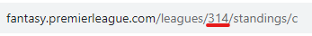
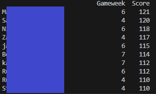

# FPL Highest Gameweek Score Fetcher

## Overview

This project is a Python script that helps you fetch the highest gameweek scores for managers in a Fantasy Premier League (FPL) classic league. It utilizes the FPL API to retrieve and display the each managers highest scoring gameweek and which gameweek it was.

Current functionality only allows for managers appearing on the front page of the standings to be included (50 managers), in future the ability to check multiple pages of standings will be added.

## Video Demo

https://www.youtube.com/watch?v=uvELvxNAoQU

## Features

- Retrieve the highest gameweek scores for managers in your FPL classic league.
- Display the highest individual gameweek scoring managers in a user-friendly format.

## Installation

1. Clone this repository:

   ```bash
   git clone https://github.com/PatrickJFBurke/FPL_League_Highest_GW_Score.git
   cd FPL_League_Highest_GW_Score
2. Install the required Python libraries:

    ```bash
    pip install requests
    pip install pandas
## Usage
1. Obtain your FPL classic league's ID from the FPL website.
    
    

2. Run the script:
    ```bash
    python fpl_highest_gw_score.py

3. Enter your FPL classic league ID when prompted:

    ```python
    Enter League ID (Enter 0 to exit): your_league_id_here

4. The script will fetch and display the highest gameweek scores for players in your FPL classic league.
    
    

## TODO
- [ ] Add ability to not count gameweeks where certain chips/any chips were used
- [ ] Add functionality to check more than one page of standings

# License
This project is licensed under the MIT License.

# Acknowledgments
This project is inspired by the Fantasy Premier League and uses the FPL API to retrieve data.
# Support
If you have any questions, issues, or suggestions, please feel free to open an issue.